# Voronoi Diagram 報告

## 軟體規格書


* ### 輸出與輸入（資料）規格


**輸入：**
	+ 畫布上任意點擊，畫布大小為 602 x 602
	+ 輸入檔.txt，包含多筆測資與註解，[輸入檔案範例](https://wendy062644.github.io/other/vd_testdata.in)
	+ 輸出檔.txt，直接在畫布中繪製線與點，格式如下方輸出檔案範例**輸出：**
輸出檔案格式如下：


	+ 點：`P X Y` // 每個點佔一行，兩整數 x, y 為座標
	+ 線段：`E X1 Y1 X2 Y2` // (X1, Y1) 為起點，(X2, Y2) 為終點，其中 `X1≦Y2` 或
	 `X1=X2, Y1≦Y2`
	+ 點座標在前半段，線段在後半段，且以座標用字典序(lexical order)排序**輸出文字檔案範例：**


	
	```
	
	P 100 100
	P 100 200
	P 200 100
	P 200 200
	E 0 150 150 150
	E 150 0 150 150
	E 150 150 150 600
	E 150 150 600 150
	```
* ### 功能規格與介面規格


**操作介面：**


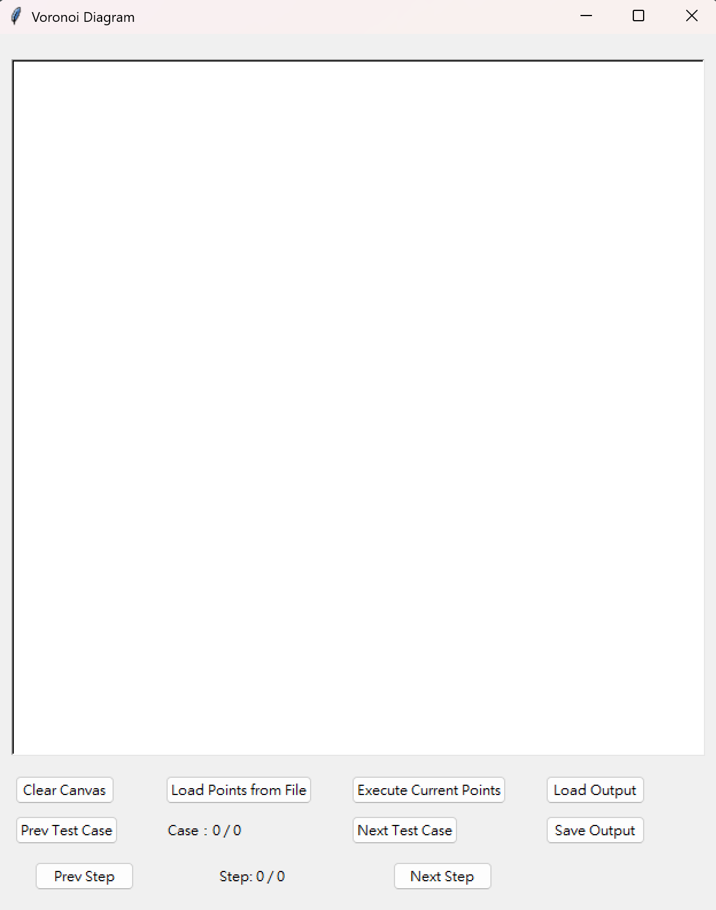
圖1 初始狀況


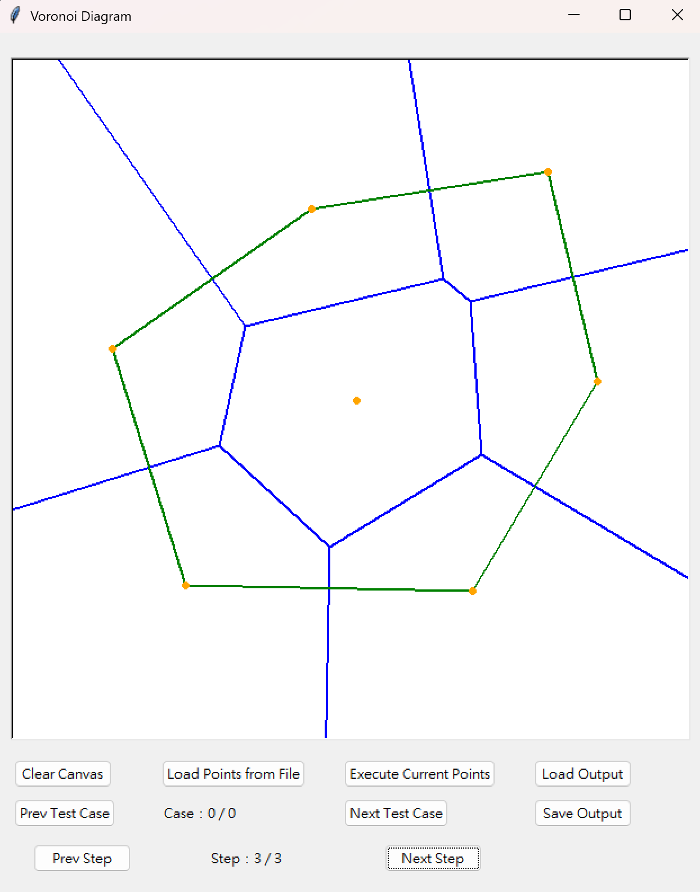
圖2 計算結果


**按鈕功能**
	+ Clear Canvas：清除畫布上所有點與線段
	+ Load Points from File：讀取輸入文字檔
	+ Execute Current Points：計算當下畫布上的點
	+ Load Output：讀取輸出文字檔
	+ Prev Test Case：顯示上一筆測資  Next Test Case：顯示下一筆測資
	+ Save Output：輸出「輸出文字檔」
	+ Prev Step：合併步驟中的上一步  Next Step：合併步驟中的下一步
* ### 軟體測試規劃書


1 點：不做任何動作


2 點：找兩點的垂直平分線


3 點：找三點的外心，並以外心為為起點，往外畫出三條垂直平分線


4～6 點：Divide 及 Merge 一次


7～9 點：Divide 及 Merge 兩次


大於 9 點：Divide 及 Merge 三次 以上


## 軟體說明


* ### 軟體安裝


	+ 1. 下載程式壓縮檔
	+ 2. 解壓縮後，點擊「dist」資料夾 後再點擊「index」資料夾
	+ 3. 點擊「index.exe」執行檔
	注意：勿移動/修改/刪除其他附加文件或檔案
* ### 使用說明


**滑鼠點擊畫布**


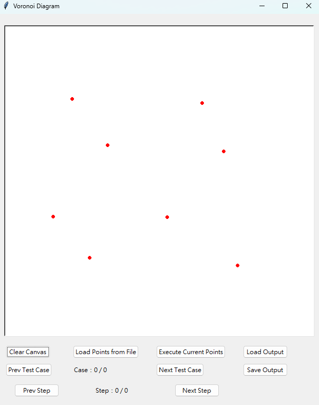
圖3 點擊畫布


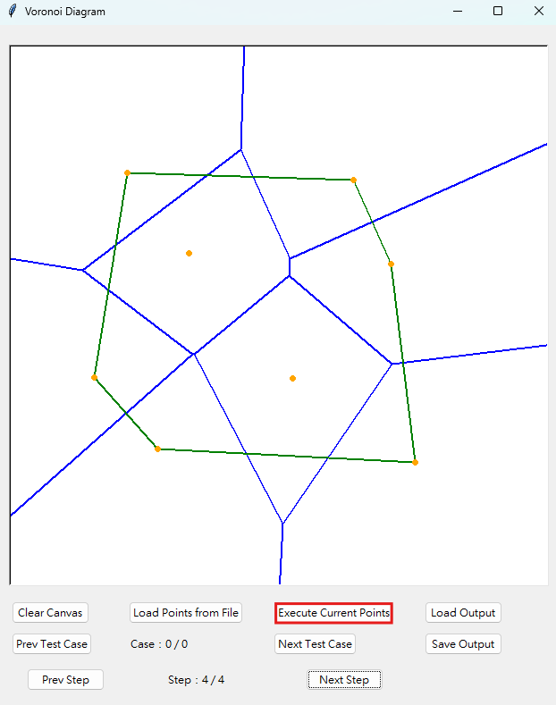
圖4 計算Voronoi Diagram


**讀取 點座標檔案**


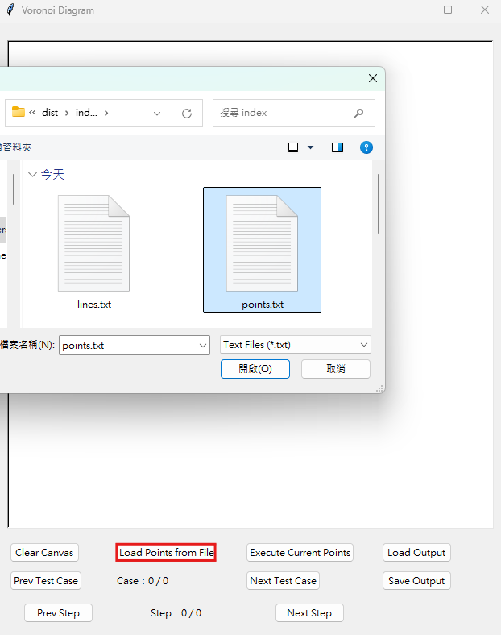
圖5 讀取點座標


圖6 自動計算Voronoi Diagram


**讀取 輸出文字檔**


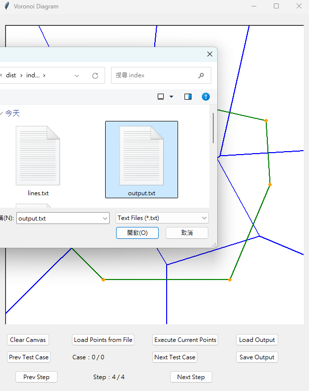
圖7 讀取輸出檔


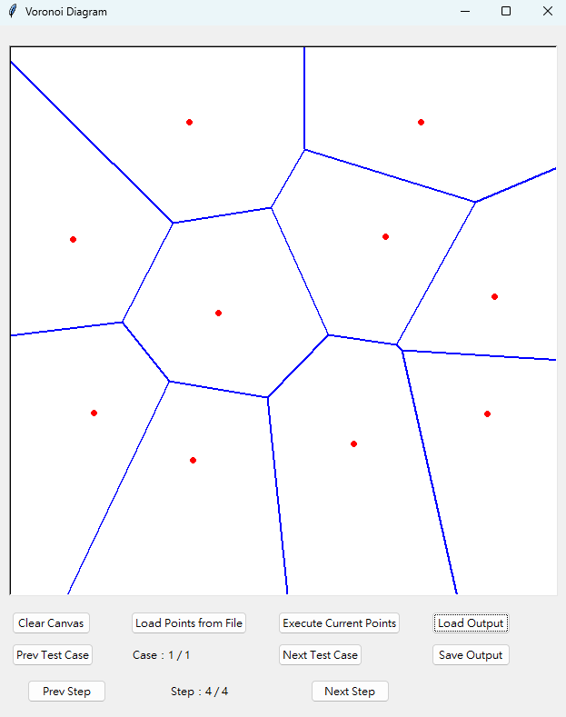
圖8 繪製點與線


**多筆測資**


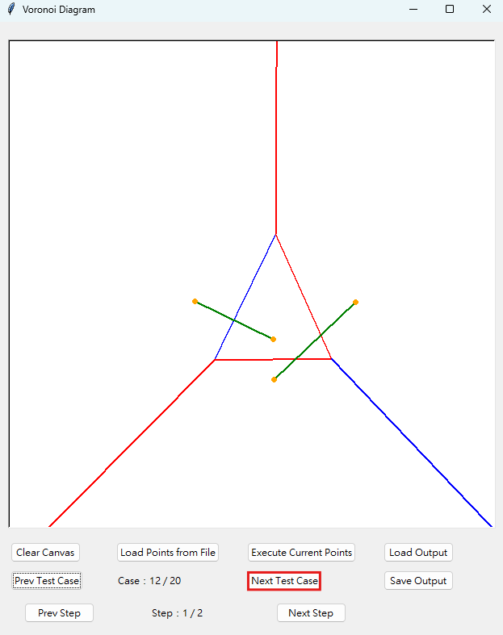
圖9 第 12/20 筆測資


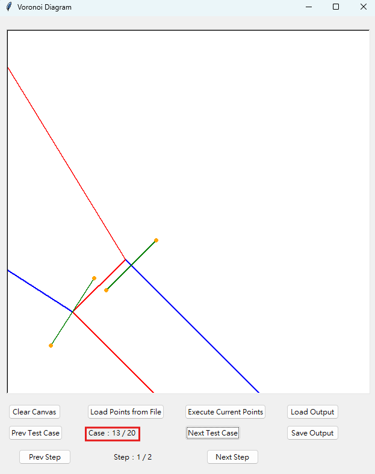
圖10 第 13/20 筆測資


**Step by Step**


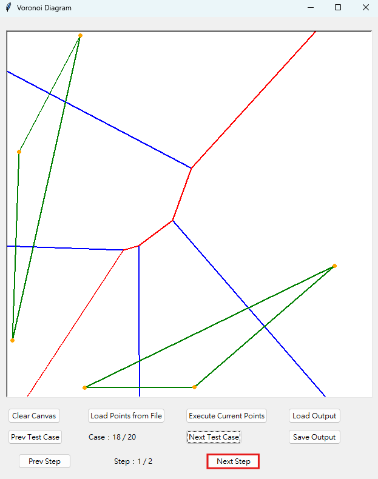
圖11 第一步(merge前)


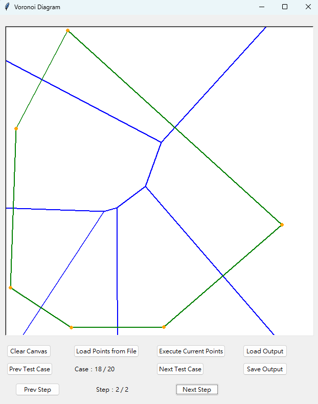
圖12 第二步(merge後)


## 程式設計


* ### 資料結構


	**Point**+ `double x, y; //紀錄點座標  
	
	 bool operator==(const Point& other) // overload 等於判斷  
	
	 Point& operator=(const Point& other) // overload 指派  
	
	 bool operator<(const Point& other) // overload 小於判斷  
	
	 bool operator!=(const Point& other) // overload 不等於判斷`
	**Edge**+ `Point Start; // 線起點座標  
	
	 Point End; // 線終點座標  
	
	 Point A; // 做中垂線的點 A 座標  
	
	 Point B; // 做中垂線的點 B 座標`
	**Point / Edge vector**+ `vector<Edge> mid_edge; // 紀錄HyperPlane的Edge  
	
	 vector<Edge> RightEdge; // 紀錄右邊的Edge  
	
	 vector<Edge> LeftEdge; // 紀錄左邊的Edge  
	
	 vector<Edge> voronoi; // 紀錄合併後的Edge  
	
	 vector<Point> RightConvexhull; // 紀錄右邊的凸包  
	
	 vector<Point> LeftConvexhull; // 紀錄左邊的凸包`* ### 三個點以下


	**兩點**+ 
	 先找出兩點的中點，再找出中垂線
	**三點**+ 找出三點的外心，再以外心為起點，往外畫出三條垂直平分線
	
	
	直角、銳角、鈍角的外心位置不同，因此在畫線時需分開處理
	
	
	
	
	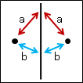
	圖13 兩點的垂直平分線
	
	
	
	
	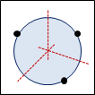
	圖14 三點的垂直平分線
* ### 超過三個點


	**流程**
	Sort：將點依照 x 座標排序，若 x 座標相同則依照 y 座標排序
	
	
	Divide：將點分成左右兩邊，再遞迴處理左右兩邊的點
	
	
	如果： 點數量 <= 3，則直接回傳垂直平分線
	
	
	否則： Merge(將左右兩邊的結果合併)
	
	
	**虛擬碼**  
	+ ````
	
	voronoi() {
	    if(點數量 == 1)
	        return;
	    else if(點數量 == 2)
	        return 兩點的垂直平分線;
	    else if(點數量 == 3)
	        return 三點的垂直平分線;
	    else {
	        L\_Point = voronoi(L, M); // 左邊的點
	        R\_Point = voronoi(M, R); // 右邊的點
	        return Merge(L\_Point, R\_Point);
	    }
	}                               
	````
	**合併(Merge)**  
	
	找出左右兩邊構成的上切線，以此出發
	
	
	途中撞到左右 Voronoi diagram ，就改變行進方向
	
	
	清除多餘的 Voronoi diagram
	
	+ Edge的起終點皆在Hyperplane的同一側(如：右側Edge的起終點皆在Hyperplane右側)，則不動作
	
	
	Edge的起終點皆在Hyperplane的另一側(如：右側Edge的起終點其一在Hyperplane的左側)，則刪除
	
	
	Edge的起終點在Hyperplane的兩側，則將另一側的點更改為相交位置
	
	
	
	
	
	圖15 合併之前
	
	
	
	
	
	
	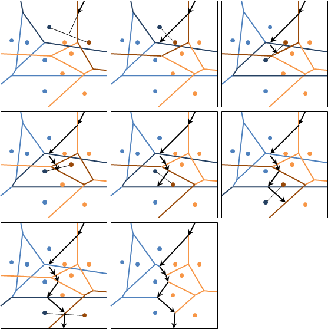
	圖16 合併過程* ### Convex Hull


	**透過 Voronoi diagram 尋找****(PPT. 4-37)**
	After a Voronoi diagram is constructed, a convex hull can by found in O(n) time.
	
	
	若該 Edge 往外無限延伸，則組成該 Edge 的A、B點為 Convex Hull 的點
	
	
	
	
	
	圖17 綠色 Edge 的A、B點為Convex Hull的點


## 軟體測試與實驗結果


* ### 執行環境


	
		- 作業系統：Windows 11 專業版 22H2
		- 編譯器：g++ 14.2.0 / Python 3.12.2
		- 硬體配置：R7 3700x / DDR4 3600MHz 8G*4 / RX6800XT
	
	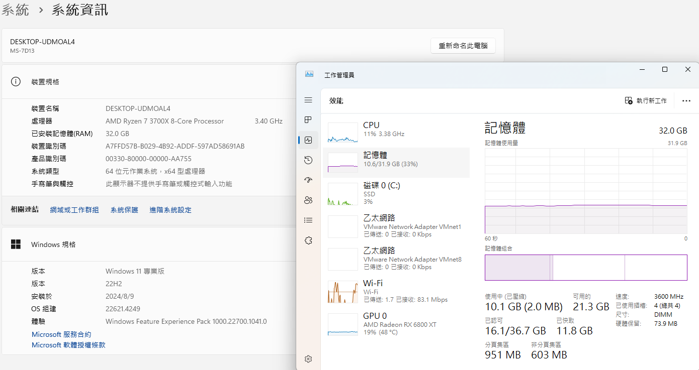
	圖18 執行環境
* ### 實驗結果


	**合併過程**
	
	
	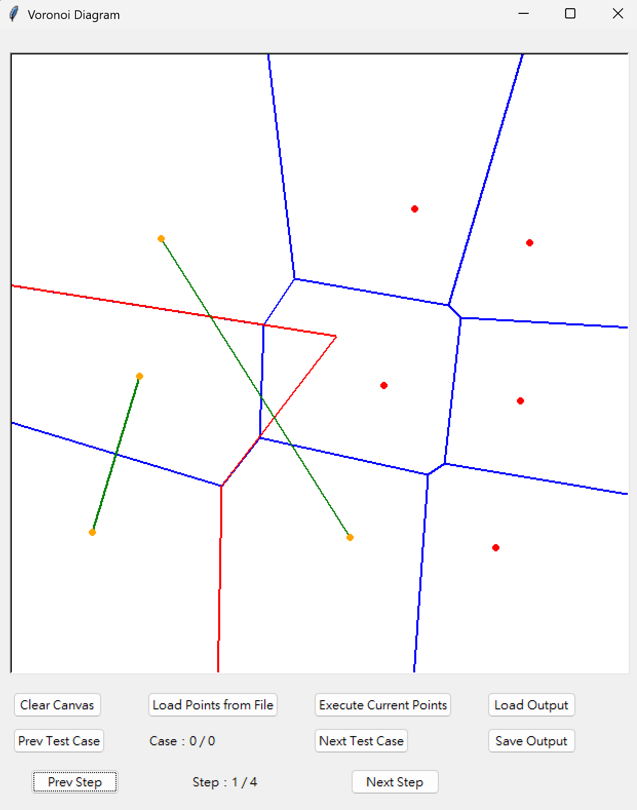
	圖19 2點與2點合併
	
	
	
	
	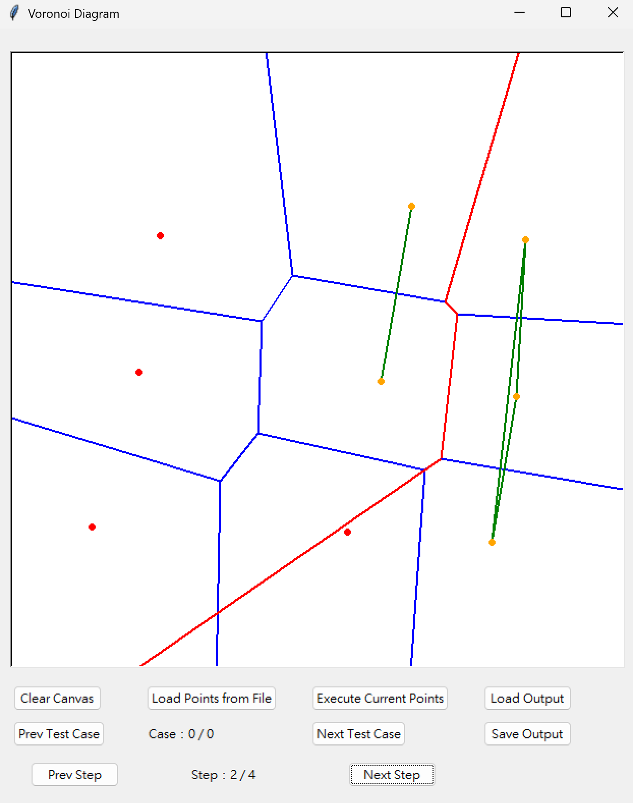
	圖20 2點與3點合併
	
	
	
	
	
	
	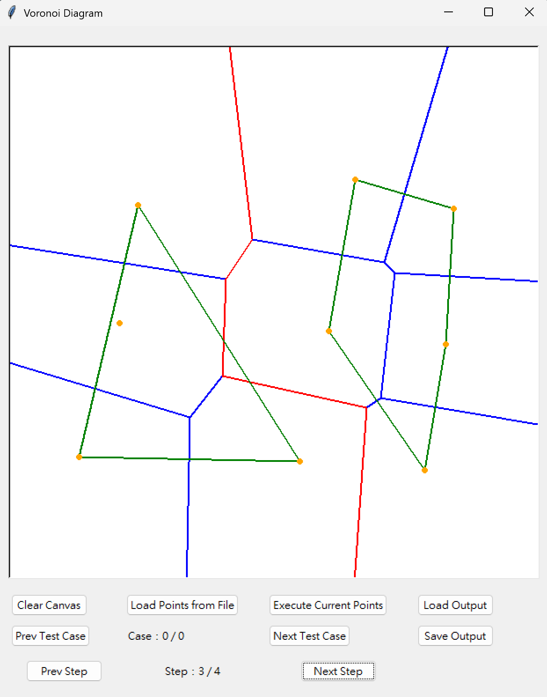
	圖21 4點與5點合併
	
	
	
	
	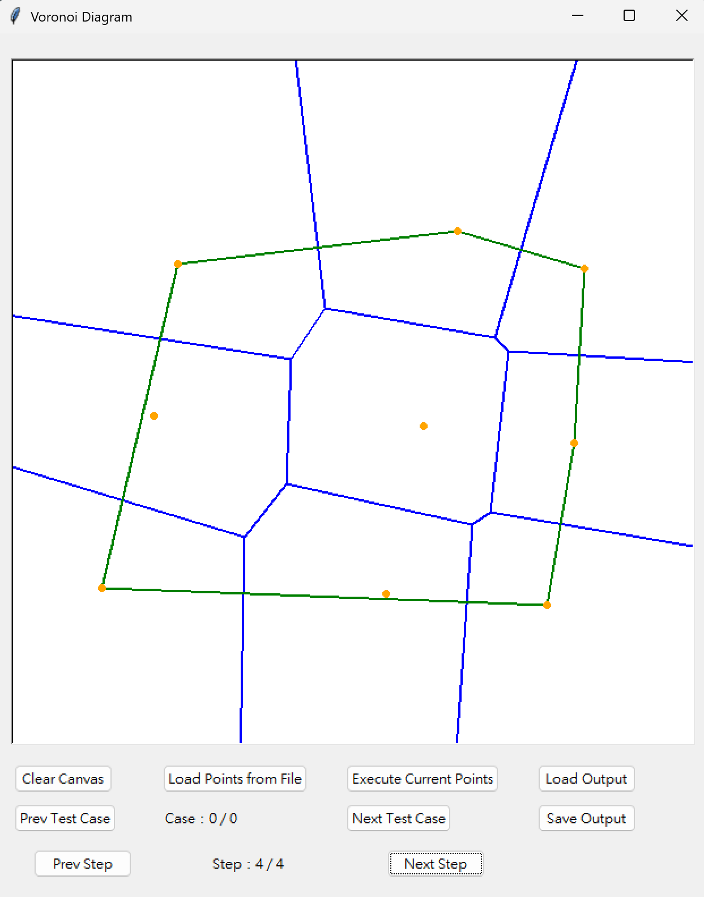
	圖22 合併結果
	
	
	
	
	**3 點以下**
	
	
	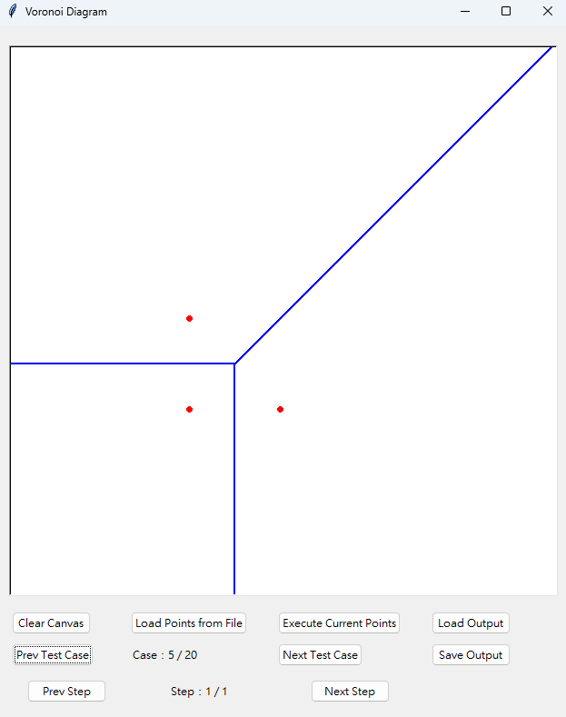
	圖23 直角三角形
	
	
	
	
	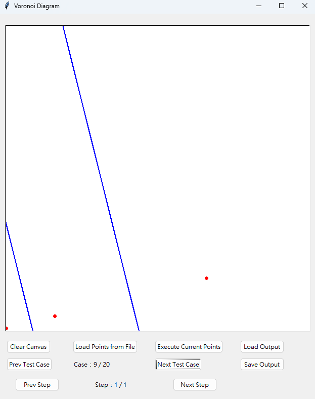
	圖24 三點平行
	
	
	
	
	**4 ~ 6 點**
	
	
	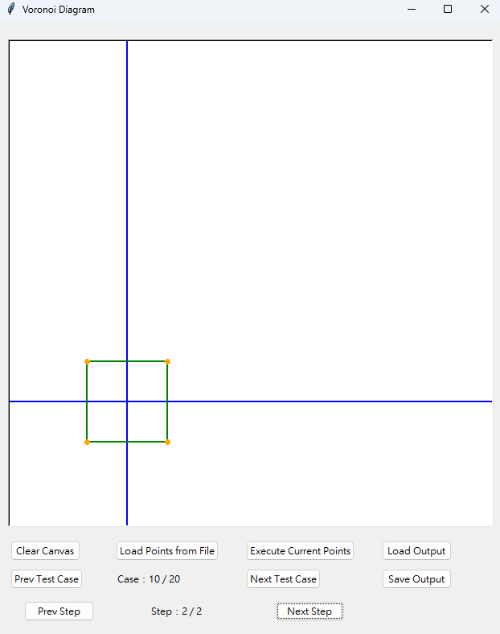
	圖25 正方形 (水平+垂直)
	
	
	
	
	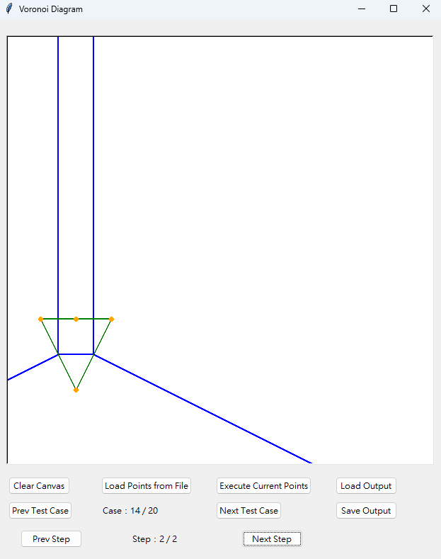
	圖26 3點水平、2點垂直
	
	
	
	
	**7 ~ 9 點**
	
	
	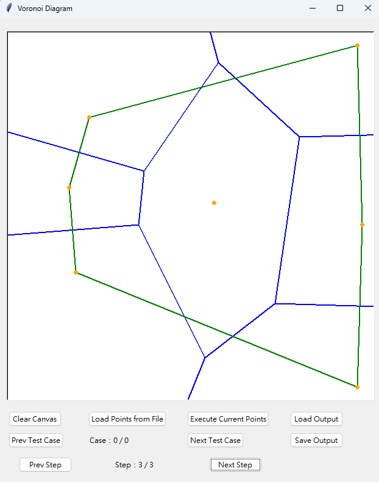
	圖27 隨機 7 點
	
	
	
	
	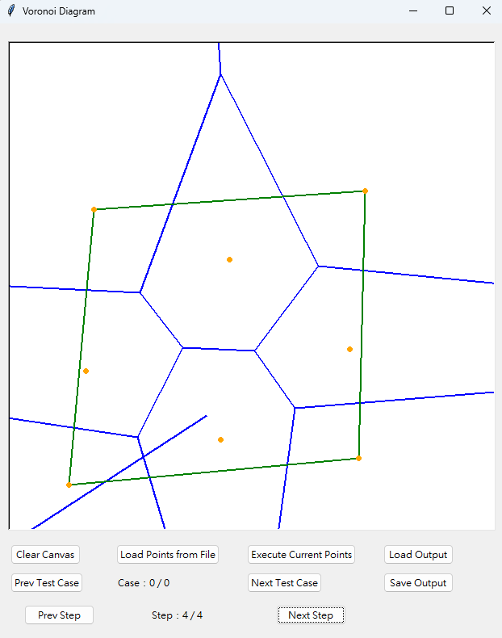
	圖28 隨機 8 點
	
	
	
	
	**10 點以上**
	
	
	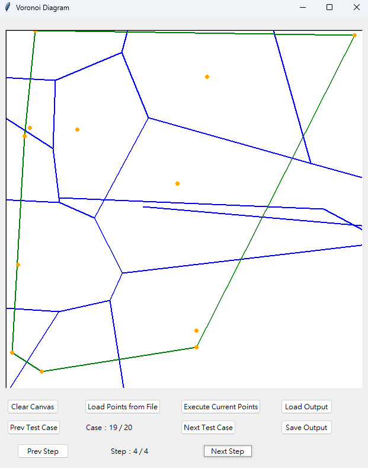
	圖29 隨機 12 點
	
	
	
	
	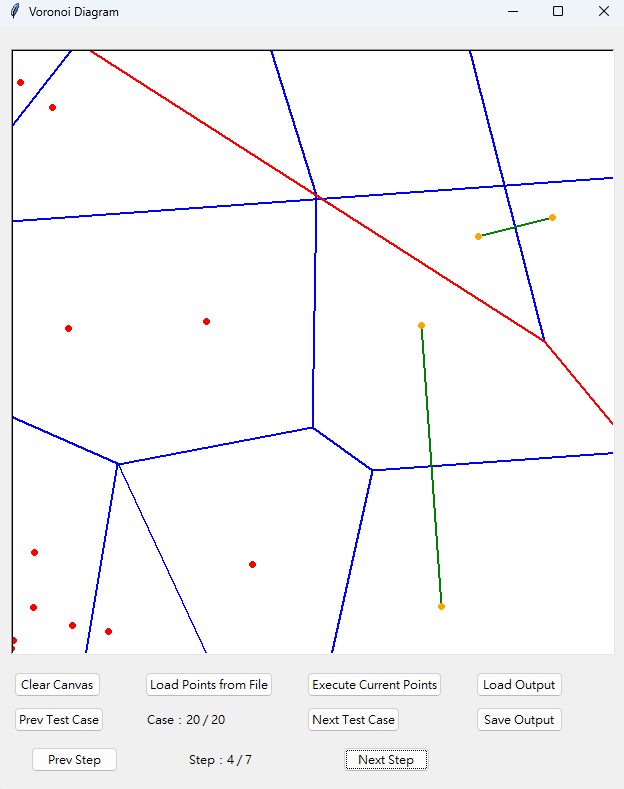
	圖30 隨機 15 點


## 結論與心得


- ### 初測


	初測的內容較簡單，只有 1~3 個點，因此只需要直接計算就好。
	
	
	較複雜的部份為三點時的處理，除了要找外心，還要判斷直角、銳角、鈍角的情況。
	
	
	而在此階段還未使用到 Divide-and-Conquer，因此很容易忽略資料結構與演算法的設計，導致後續撰寫困難。
	
	
	為了使 C++ 和 Python 打包成一個檔案，也讓我吃了不少苦頭。### 後測


	如果程式只需要divide和merge一次，則狀況較單純，找到上切線後一直往下找即可
	
	
	需注意的部分為左右的Edge與Hyperplane相交的位置相同。
	
	
	當點數量超過6個時，狀況就變得極為複雜，有許多特例需要判斷和處理
	
	
	只要有一步做錯，就會產生蝴蝶效應，而使其後續越錯越多。
	
	
	因初測時未考慮後續的規劃，經常寫到一半才發現缺少某些資料或資料結構設計不佳，為此也付出了慘痛的代價(重寫4、5次)。### 結論 / 心得


	在寫程式之前，需要詳細規劃每一個步驟，避免後續的困難。
	
	
	發現程式碼有缺漏或方向不對時，有些時候砍掉重寫會比Debug或彌補過錯來的快。
	
	
	當merge的過程出現錯誤時，很難馬上找到問題點，必須要逐行註解慢慢排除，這個過程也是十分煎熬。


## 附錄


### 相關檔案


* [C++ 程式碼 (只有計算，沒有GUI)](assets/voronoi.cpp)
* [完整程式碼 (7z壓縮檔)](assets/voronoi.7z)
* [測試輸入檔 (20筆測資，含註解)](assets/input.txt)
* [測試輸出檔](assets/output.txt)


### 相關連結


* [Voronoi diagram-演算法筆記](https://web.ntnu.edu.tw/~algo/Neighbor.html)
* [Chap 4. The
 Divide-and-Conquer Strategy](https://par.cse.nsysu.edu.tw/~cbyang/course/algo/algonote/algo4.ppt)


